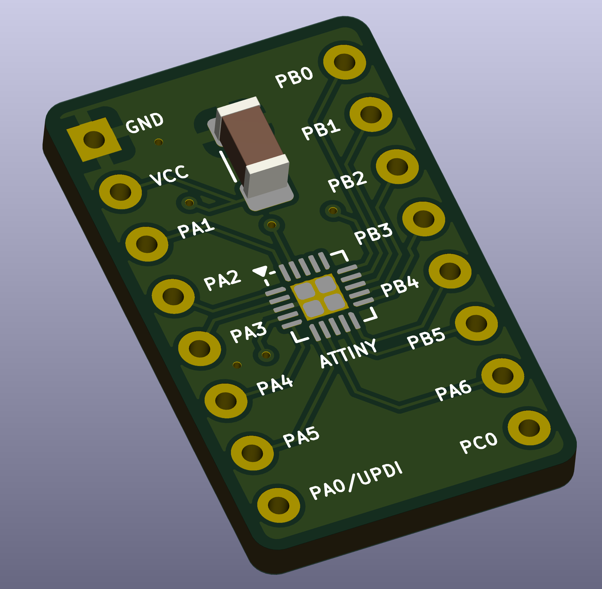
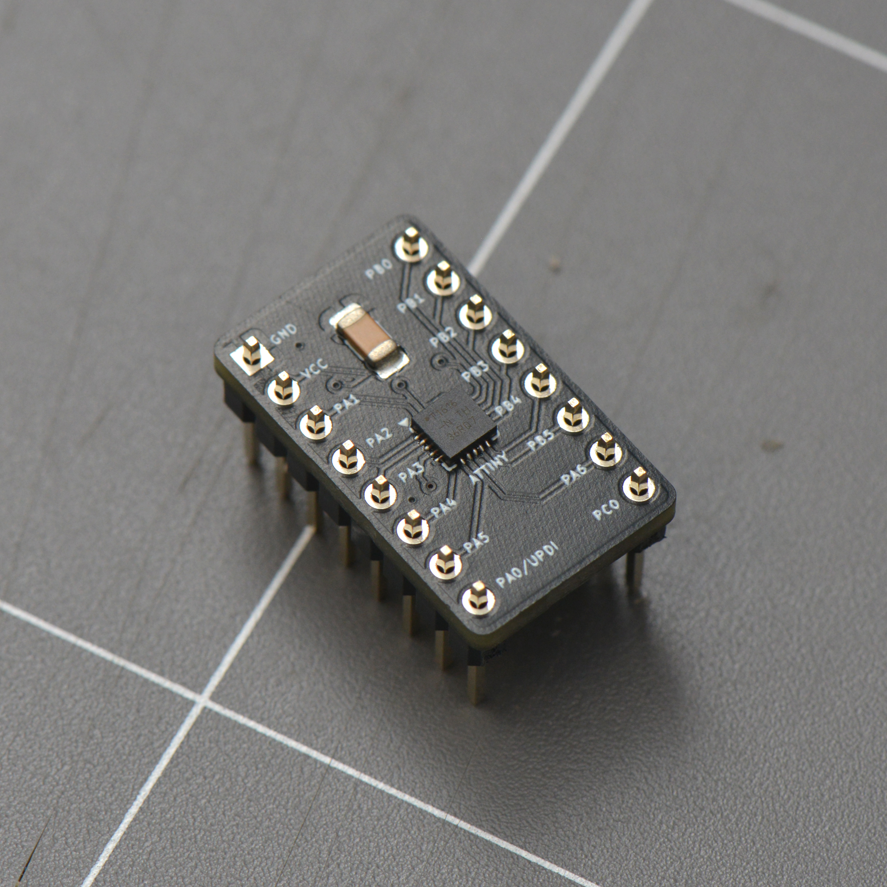

## Breakout board for the attiny1616 (20 VQFN)

To keep things small (DIP-16), only a subset of pins are avalable — Port A pins (PA0-PA6) and Port B pins (PB0-PB5), along with a single PC0 pin;

A small 0.1uF decoupling capacitor is also included to simplify usaged on the breadboard.

